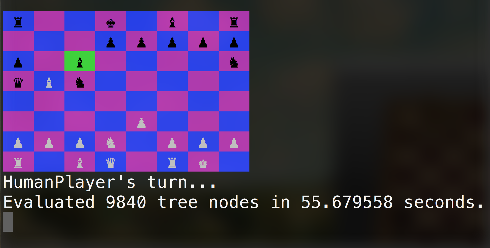

# Ruby Chess

Two player chess, coded in Ruby, playable in terminal.

## How To Play

### Setup

1. Clone this repo: `git clone https://github.com/AlexanderRichey/Chess`.
2. Navigate to the repo in your command line.
3. Start a game by typing `ruby game.rb`.

### Game Play

- Use the arrow keys to navigate the board.
- Press `Enter` to pick up and put down a piece. When a piece is selected, it will turn green.

### Saving and Loading Games

- Type `s` to save your game. You will be prompted to enter a filename and your file will be saved in the same directory in which your game is running.
- Load a game by typing `ruby game.rb #{your_game}` in your command line.

## To Do

- [ ] Add AI...

## Screenshot

